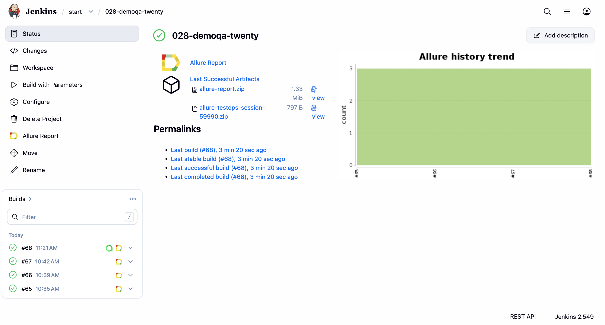
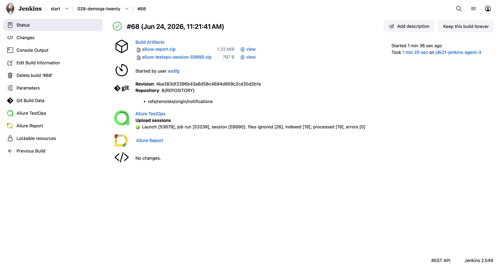
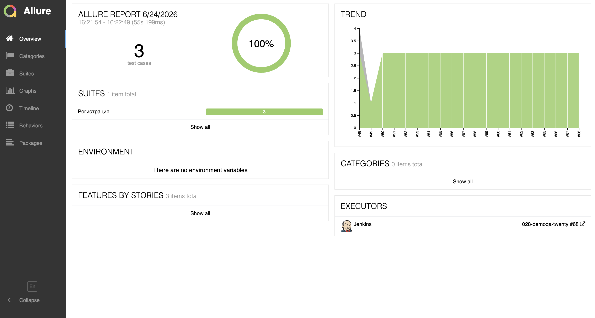
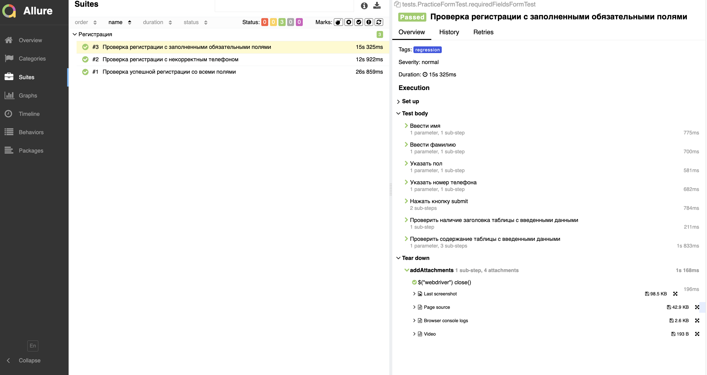
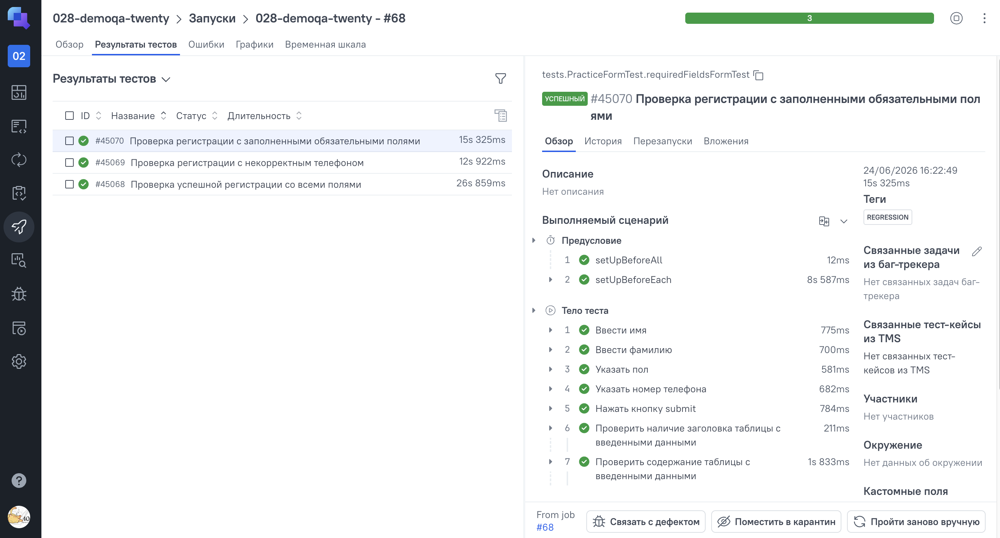
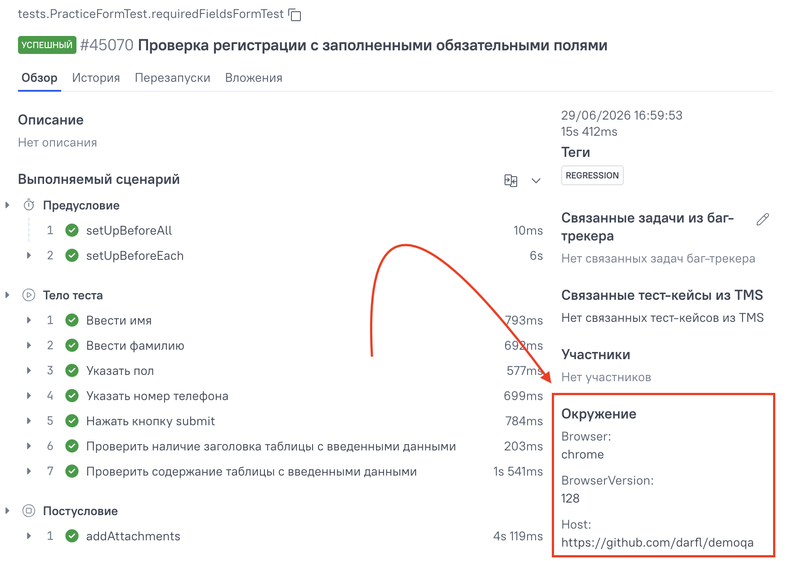
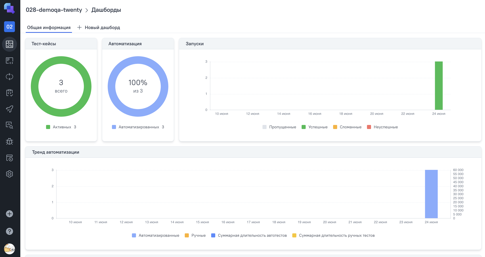

# Проект по автоматизации тестирования [DemoQA](https://demoqa.com/automation-practice-form) 

> Проект автоматизированного тестирования формы [Student Registration Form](https://demoqa.com/automation-practice-form) на сайте demoqa.com. Демонстрирует навыки написания поддерживаемых UI-тестов на Java с использованием паттерна Page Object Model, генерации случайных тестовых данных и формирования отчётов Allure с интеграцией в CI/CD.


## **Содержание:**

* <a href="#tools">Технологии и инструменты</a>

* <a href="#cases">Тестовые сценарии</a>

* <a href="#jenkins">Сборка в Jenkins</a>

* <a href="#console">Запуск из терминала</a>

* <a href="#allure">Allure отчёт</a>

* <a href="#telegram">Уведомление ботом в Telegram о сборке</a>

* <a href="#video">Видео выполнения теста в Selenoid</a>

* <a href="#testops">Интеграция с Allure TestOps</a>

* <a href="#jira">Интеграция с Jira</a>


<a id="tools"></a>
## <a name="Технологии и инструменты">**Технологии и инструменты:**</a>

<p align="center">  
<a href="https://www.jetbrains.com/idea/"></a>  
<a href="https://www.java.com/"></a>  
<a href="https://github.com/"></a>  
<a href="https://junit.org/junit5/"></a>  
<a href="https://gradle.org/"></a>  
<a href="https://selenide.org/"></a>  
<a href="https://aerokube.com/selenoid/"></a>  
<a href="https://github.com/allure-framework/allure2"></a> 
<a href="https://qameta.io/"></a> 
<a href="https://www.jenkins.io/"></a> 
<a href="https://web.telegram.org/"></a>  
<a href="https://www.atlassian.com/ru/software/jira/"></a>  
</p>

- **IntelliJ IDEA**: Среда разработки для написания кода.
- **Java**: Основной язык программирования проекта.
- **GitHub**: Платформа для хостинга и совместной разработки кода.
- **JUnit 5**: Фреймворк для написания и выполнения тестов.
- **Gradle**: Система сборки проекта.
- **Selenide**: Библиотека для написания UI-тестов с авто-ожиданиями и лаконичным API.
- **Selenoid**: Инструмент для управления браузерами в Docker-контейнерах.
- **Allure**: Фреймворк для генерации подробных отчётов о тестировании.
- **Jenkins**: Инструмент для автоматизации сборки и CI/CD.
- **Telegram**: Мессенджер для уведомлений о статусе сборки.
- **Jira**: Платформа для управления проектами и отслеживания задач.
- **Allure TestOps**: Платформа для управления тестированием и анализа результатов.


<a id="cases"></a>
## <a name="Тестовые сценарии">**Тестовые сценарии:**</a>

- ✅ Проверка полного заполнения формы всеми полями
- ✅ Проверка заполнения только обязательных полей
- ✅ Негативный кейс с невалидным номером телефона

Тесты реализованы с использованием **Page Object Model** и компонентного подхода (`CalendarComponent`, `ResultTableComponent`). Тестовые данные генерируются случайным образом через **JavaFaker**, при этом город автоматически зависит от выбранного штата, что гарантирует валидность данных. Для фильтрации запусков используются теги: `@Tag("positive")`, `@Tag("negative")`, `@Tag("regression")`.


<a id="jenkins"></a>
## </a> <a name="Сборка"></a> Сборка в [Jenkins](https://jenkins.autotests.cloud/view/start/job/028-demoqa-twenty/)</a>
Jenkins используется для автоматизации сборки и тестирования проекта. Он позволяет любому члену команды запускать тесты в любое время.

<p align="center">  
  
</p>

<p align="center">  
  
</p>


### **Параметры сборки в Jenkins:**

- `browser` – браузер, по умолчанию chrome
- `browserVersion` – версия браузера, по умолчанию 122
- `browserSize` – размер окна браузера, по умолчанию 1920x1080
- `remoteUrl` – логин, пароль и адрес удалённого сервера Selenoid


<a id="console"></a>
## Команды для запуска из терминала

***Локальный запуск всех тестов:***
```bash  
./gradlew test
```

***Запуск в Selenoid (удалённо):***
```bash  
remoteUrl="https://selenoid.autotests.cloud/wd/hub" ./gradlew test
```

***Фильтрация по тегам:***
```bash  
./gradlew test -Dtype=positive    # только позитивные
./gradlew test -Dtype=negative    # только негативные
./gradlew test -Dtype=regression  # все regression-тесты
```

***Смена браузера и разрешения:***
```bash  
./gradlew test -Dbrowser=firefox -Dversion=125 -DwindowSize=1366x768
```

***Генерация и просмотр Allure-отчёта:***
```bash  
./gradlew allureServe
```


<a id="allure"></a>
## </a> <a name="Allure"></a> Allure [отчёт](https://jenkins.autotests.cloud/view/start/job/028-demoqa-twenty/allure/)</a>

Allure используется для генерации подробных отчётов о тестировании. Каждый метод страницы аннотирован `@Step` с описанием на русском языке — в отчёте виден пошаговый сценарий выполнения теста. После каждого теста автоматически прикрепляются скриншот, page source, логи браузера и видео прогона.

### Главная страница отчёта

<p align="center">  
  
</p>

### Детали тестового сценария

<p align="center">  
  
</p>


<a id="telegram"></a>
## </a> Уведомление ботом в Telegram о сборке
Настроены уведомления в Telegram для получения информации о статусе сборки и результатах тестирования.

<p align="center">  
  
</p>


<a id="video"></a>
## </a> Видеозаписи выполнения тестов в Selenoid
Помогают визуально проверять, как проходят тесты и выявлять проблемы. К каждому тесту в Allure-отчёт прикрепляется видео прогона из Selenoid.

<p align="center">
   
</p>


<a id="testops"></a>
## </a> Интеграция с [Allure TestOps](https://allure.autotests.cloud/project/5264/test-cases?treeId=0)
Allure TestOps — это платформа для централизованного управления тестами, автоматизации тестирования и анализа результатов. Она поддерживает различные CI/CD инструменты и тестовые фреймворки, предоставляя подробные отчёты и аналитику.

<p align="center">  
  
</p>


### Настройка окружения
<p align="center">  
  
</p>


### Allure TestOps Dashboard

<p align="center">  
  
</p>


<a id="jira"></a>
## </a> Интеграция с [Jira](https://www.atlassian.com/ru/software/jira/)
Jira — это инструмент для управления проектами и задачами, который помогает командам планировать, отслеживать и выпускать ПО. Интеграция с Jira позволяет централизованно управлять задачами, автоматизировать процессы и улучшать командное взаимодействие.

<p align="center">  
  
</p>


<a id="other"></a>
## <a name="Прочее">**Прочее:**</a>

### Плагины
- **java-library**: Плагин для работы с Java библиотеками.
- **io.qameta.allure (версия 2.12.0)**: Плагин для интеграции с Allure для генерации отчётов.

### Репозитории
- **mavenCentral**: Репозиторий Maven Central для получения зависимостей.

### Зависимости (Dependencies)
- **Selenide (версия 7.2.3)**: Фреймворк для написания лаконичных и стабильных UI-тестов на Java.
- **JUnit 5 (версия 5.10.0)**: Фреймворк для модульного тестирования на Java.
- **Java Faker (версия 1.0.2)**: Библиотека для генерации фейковых данных для тестирования.
- **Allure Selenide (версия 2.27.0)**: Интеграция Selenide с Allure для детализированных отчётов.
- **SLF4J Simple (версия 2.0.7)**: Простая фасадная библиотека для логирования в Java.

### Конфигурация
- **Конфигурация Allure** для генерации отчётов с использованием JUnit 5 адаптера.
- **Конфигурация задач тестирования** с использованием JUnit Platform и логированием событий тестов (started, skipped, failed, standard_error, standard_out).
- Передача системных свойств (`-D`) в задачи тестирования для гибкой настройки браузера, версии, разрешения и удалённого URL.
- Условное включение тегов тестов на основе системного свойства `type` (`@Tag("positive")`, `@Tag("negative")`, `@Tag("regression")`).

### Классы-помощники (Helper Classes)
- **AllureAttachments**: Содержит методы для захвата скриншотов, исходного кода страницы (page source), логов консоли браузера и встраивания видео из Selenoid в отчёты.
- Использован **Selenoid** для удалённого запуска браузеров в Docker-контейнерах с VNC-трансляцией и записью видео.

### Интеграция с Telegram
Выполнена интеграция с Telegram для автоматической отправки уведомлений о статусе сборки (в Jenkins) и результатов тестирования в Telegram-канал.
